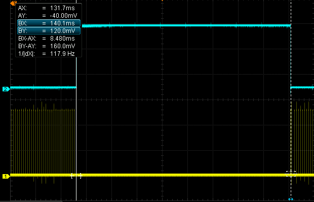

## FFT	
The program is able to determine a number of bins of a 128 points FFT. It is completely written in AVR Assembler and was tested on an ATmega 1284 with 20 MHz external crystal oscillator. Schematics can be viewed at [atmega_fft_hardware](https://github.com/ncalbrecht/atmega_fft_hardware).

The algorithm is a radix-2 decimation-in-time FFT according to [Cooley–Tukey](https://en.wikipedia.org/wiki/Cooley%E2%80%93Tukey_FFT_algorithm). The implementation follows an understandable way than optimizing to the last clock cycle. 

It takes 8.4ms to calculate 16 bins on an ATmega 1284 with 20MHz external crystal oscillator. The result is displayed on a 16x8 LED-Matrix in negligible short time.

*This project was part of an university lab.*
